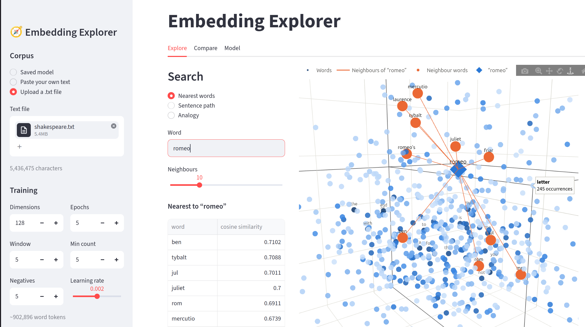

<div align=center>

# Embedding Explorer

[](https://www.python.org/)
[](https://pytorch.org/)
[](https://streamlit.io/)

Train word embeddings from scratch and explore them in an interactive 3D space.



</div>

Embedding Explorer implements skip-gram word2vec with negative sampling in
PyTorch—without pretrained models or gensim. Use [Tiny Shakespeare](https://github.com/karpathy/char-rnn/blob/master/data/tinyshakespeare/input.txt) or provide
your own text.

## Features

- Interactive 3D projections with PCA, t-SNE, or optional UMAP
- Nearest-neighbor search and cosine similarity heatmaps
- Word analogies such as `king - man + woman`
- Sentence paths through the embedding space
- Frequency and cluster-based coloring

## Quick start

```bash
python -m venv .venv
source .venv/bin/activate
pip install -r requirements.txt

python train/fetch_data.py
python train/train_word2vec.py
streamlit run app.py
```

Training Tiny Shakespeare takes roughly 3–8 minutes on a two-core CPU. The
model is saved to `models/` and loaded automatically by the app.

You can also launch the app first, then paste or upload text and train from the
sidebar. For useful embeddings, aim for at least a few thousand tokens—the
larger the corpus, the better.

## Train on your own text

```bash
python train/train_word2vec.py --text data/mybook.txt
python train/train_word2vec.py --epochs 8 --dim 200
python train/train_word2vec.py --help
```

Generated artifacts are `vectors.npz`, `vocab.json`, and `meta.json` inside
`models/`.

## Project structure

```text
app.py                    Streamlit interface
src/corpus.py             Corpus preparation
src/word2vec.py           SGNS model and training
src/reduce.py             3D projection and clustering
src/search.py             Neighbors, analogies, and sentence paths
src/viz3d.py              Plotly visualizations
train/fetch_data.py       Tiny Shakespeare downloader
train/train_word2vec.py   Training CLI
```

## License

Released under [MIT License](./LICENSE.txt).

&copy; 2026-present [Henry Hale](https://github.com/henryhale)
